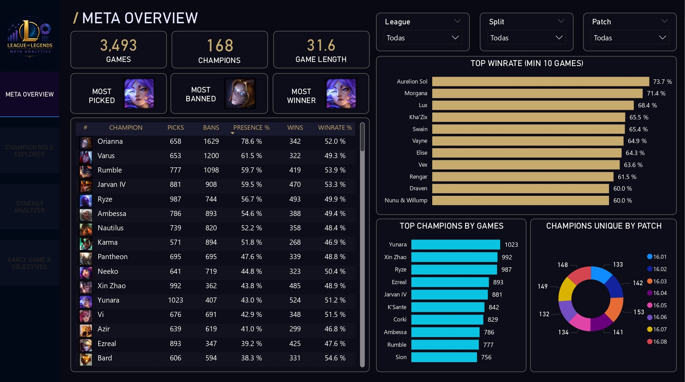
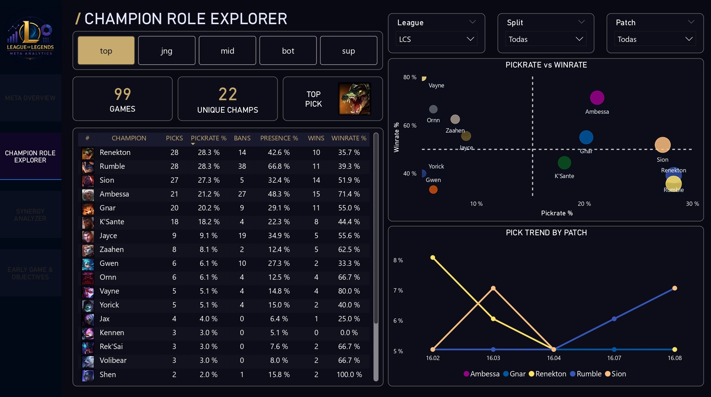
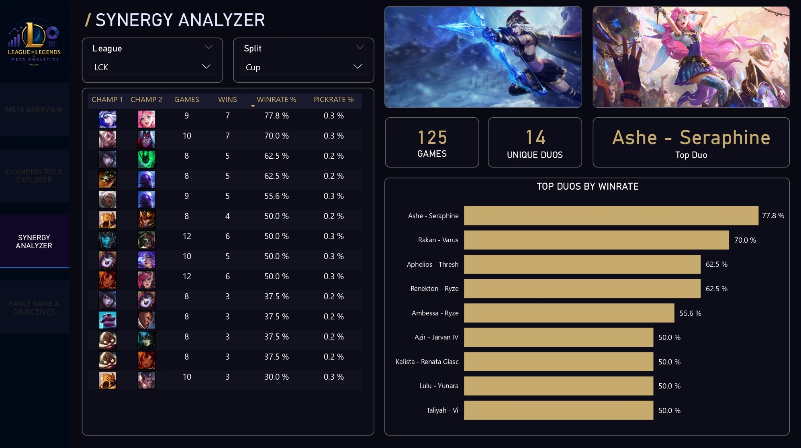
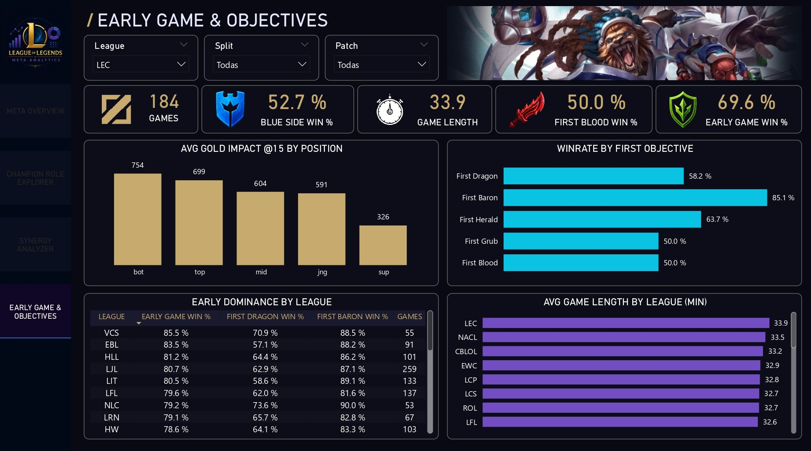

# 🎮 LoL Meta Analytics — League of Legends Competitive Dashboard

> Dashboard interactivo en **Power BI** que analiza el meta competitivo de League of Legends usando datos reales de Oracle Elixir (Season 2026). Pipeline de datos en Python + DuckDB que transforma el dataset crudo en un modelo estrella listo para BI.



---

## 📊 Qué responde este dashboard

- ¿Qué campeones dominan el meta por liga, split y patch?
- ¿Qué combinaciones de dúos tienen mayor winrate?
- ¿Qué objetivos son más decisivos para ganar un partido?
- ¿Cómo evoluciona el meta entre patches?

---

## 🖼️ Páginas del dashboard

### 1. Meta Overview
*Tabla completa de campeones con picks, bans, presence% y winrate. Top campeones por winrate y por games jugados. Distribución de campeones únicos por patch.*


### 2. Champion Role Explorer
*Análisis por rol con scatter de Pickrate% vs Winrate% y evolución del meta por patch. Filtro interactivo por rol (top/jng/mid/bot/sup).*



### 3. Synergy Analyzer
*Top dúos por winrate con splash arts automáticos del mejor dúo según el filtro activo.*



### 4. Early Game & Objectives
*Impacto de gold diff @15 por posición, winrate por primer objetivo y dominancia de early game por liga.*



---

## ⚙️ Pipeline de datos

```text
Oracle Elixir CSV  ->  Python (DuckDB)  ->  Parquet  ->  Power BI
```

| Etapa          | Herramienta                  | Descripción                                 |
| -------------- | ---------------------------- | ------------------------------------------- |
| Extracción     | Python + DuckDB              | Lee el CSV y construye el modelo estrella con SQL |
| Transformación | SQL (CTEs, window functions) | Métricas de meta, sinergias, early game     |
| Carga          | Parquet                      | Exportación optimizada para Power BI        |
| Visualización  | Power BI Desktop             | Dashboard interactivo de 4 páginas          |

---

## 🗂️ Modelo de datos (estrella)

```text
Dim_Champion        -> catálogo de campeones con rol principal
Dim_Game            -> catálogo de partidos
Dim_League          -> ligas y regiones
Dim_Date            -> tabla de fechas

Fact_ChampionStats  -> picks/bans/presence/winrate por league+split+patch
Fact_PlayerGame     -> rendimiento individual por partida
Fact_TeamGame       -> objetivos y resultado por equipo
Fact_DraftPick      -> picks unpivoteados (pick1-5)
Fact_DraftBan       -> bans unpivoteados (ban1-5)
Fact_Synergies_Duo  -> dúos con winrate y pickrate
```

---

## 🚀 Cómo usarlo

### Requisitos

```bash
pip install -r requirements.txt
```

### Actualizar datos

1. Descarga el CSV más reciente desde [Oracle's Elixir](https://oracleselixir.com/tools/downloads)
2. Reemplaza `data/raw/oracles_elixir_latest.csv`
3. Ejecuta el pipeline:

```bash
python scripts/01_build_db.py
python scripts/02_validate.py
```

4. Actualiza Power BI — los Parquet en `data/processed/parquet/` se recargan automáticamente.

---

## 📁 Estructura del proyecto

```text
lol-meta-analytics/
├── scripts/
│   ├── 01_build_db.py          # Pipeline principal: CSV -> DuckDB -> Parquet
│   ├── 02_validate.py          # Validación de integridad de los datos
│   └── 03_check.py             # Chequeos rápidos
├── data/                       # Datos locales (gitignored)
│   ├── raw/                    # CSV de Oracle Elixir
│   └── processed/              # DuckDB + Parquet generados
├── docs/screenshots/           # Capturas del dashboard
├── lol_meta_analytics.pbix     # Dashboard de Power BI
├── requirements.txt
└── README.md
```

> Los datos (`data/`) no se incluyen en el repositorio por tamaño y se regeneran ejecutando el pipeline.

---

## 🛠️ Stack técnico

- **Python 3** — lógica del pipeline
- **DuckDB** — base de datos analítica con SQL avanzado
- **Pandas** — transformación de datos
- **Parquet** — formato columnar optimizado para BI
- **Power BI Desktop** — visualización y medidas DAX
- **Oracle Elixir** — fuente de datos (Season 2026, ~34 ligas, ~3,400 partidos)

---

## 👤 Autor

**Alexis Zapata** — Analista de Datos con 6 campañas en agroindustria peruana (Virú Group, 2020-2025), con foco progresivo en reportería y análisis. Bachiller en Ingeniería Informática (UNP). Construyendo portafolio público con stack de datos moderno.

- LinkedIn: [alexiszapata19](https://www.linkedin.com/in/alexiszapata19/)
- GitHub: [@szkad](https://github.com/szkad)

---

## 🔗 Proyectos relacionados

- **[piquillo-bi-platform-peru](https://github.com/szkad/piquillo-bi-platform-peru)** — Plataforma BI end-to-end con SQL Server DW, ETL y Power BI con Row-Level Security.
- **[climate-lakehouse-pe](https://github.com/szkad/climate-lakehouse-pe)** — Lakehouse moderno con arquitectura medallion (DuckDB + Parquet) y forecasting con Prophet.

---

## 📄 Licencia

MIT — ver [LICENSE](LICENSE).
